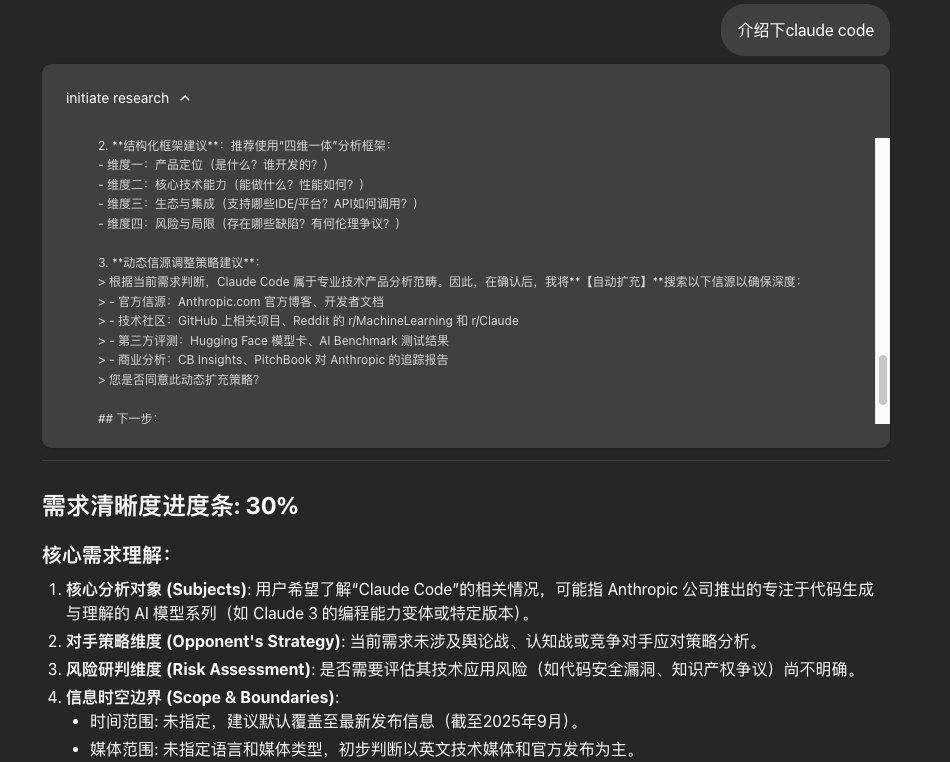

# LangGraph DeepResearch

基于 LangGraph 构建的 Multi-Agent 深度研究系统。输入一个研究课题，系统自动完成**需求澄清 → 多轮网络搜索 → 迭代报告生成**全流程，最终输出一份带引用来源的专业研究报告。



## 核心架构

系统采用三阶段流水线 + Critic-Writer 辩论循环架构：

```
用户提问
   ↓
PlanNode (需求澄清 + 人工确认)
   ↓
ResearchAgent (并行搜索 + 反思循环)
   ↓
WriterAgent (大纲 → 草稿 → Critic评审循环 → 润色)
   ↓
输出研究报告
```

### ResearchAgent — 搜索与反思循环

```
拆解关键词 → Fan-out 并行搜索 → 整合摘要 → Critique 自评充分性
                                    ↑                      ↓
                                    └── 不足则补搜 ←──── 不足
                                        充足 → 退出
```

- **Fan-out 并行搜索**：通过 LangGraph `Send` 机制，多关键词同时发起网络搜索
- **Critique 反思**：LLM 自评信息是否充分，自动发现知识盲区并生成补充查询词
- **安全兜底**：`max_research_loops` 限制最大搜索轮数

### WriterAgent — Critic-Writer 辩论循环

```
Outline → Draft → Critic 结构化评审 → 通过 → Cite & Polish → 输出
                       ↓
                    未通过 → 带回修改意见 → Draft (修订模式)
```

- **Critic 五维评审**：事实准确性 / 逻辑完整性 / 覆盖度 / 引用质量 / 语言表达
- **结构化反馈**：问题分级（critical / major / minor）+ 0-10 评分
- `max_revisions` 兜底，防止无限修改循环

### PlanNode — 人工确认 (HITL)

- **五维分析框架**：核心对象 → 对手策略 → 风险研判 → 信息边界 → 呈现形式
- 生成研究计划后暂停，等待用户点击确认
- 支持关键词检测 + LLM 意图识别双重判断

## 技术栈

| 层级 | 技术 |
|------|------|
| Agent 编排 | LangGraph + LangChain |
| 后端服务 | FastAPI + LangGraph Server |
| LLM 调用 | OpenAI 兼容接口 (通配千问/DeepSeek 等) |
| 网络搜索 | 阿里百炼 MCP 搜索服务 |
| 前端 | React 18 + TypeScript + Vite |
| UI | shadcn/ui + Tailwind CSS |
| 流式通信 | LangGraph SDK (useStream + SSE) |

## 项目结构

```
├── backend/
│   └── src/agent/
│       ├── graph.py                # 主图编排
│       ├── state.py                # 全局状态定义
│       ├── configuration.py        # 配置 + 模型列表管理
│       ├── base_agent.py           # Agent 继承体系 + 速率限制器
│       ├── prompts.py              # 10 套提示词模板
│       ├── tools_and_schemas.py    # Pydantic 结构化 Schema
│       ├── post.py                 # AI 返回内容提取
│       ├── utils.py                # URL 映射 + 消息处理
│       ├── app.py                  # FastAPI + /api/models 端点
│       ├── llm/llm.py              # LLM 调用封装
│       └── sub_agents/
│           ├── research_agent.py   # ResearchAgent 子图
│           └── writer_agent.py     # WriterAgent 子图 (含 Critic)
├── frontend/
│   └── src/
│       ├── App.tsx                 # 主应用 + useStream
│       ├── components/
│       │   ├── WelcomeScreen.tsx   # 欢迎页
│       │   ├── InputForm.tsx       # 输入 + 研究深度/模型选择
│       │   ├── ChatMessagesView.tsx # 对话视图
│       │   └── ActivityTimeline.tsx # Agent 实时进度
│       └── lib/api.ts             # API 调用
├── langgraph.json                  # LangGraph Server 配置
└── pyproject.toml                  # Python 项目配置
```

## 快速启动

### 1. 环境要求

- Python 3.11+
- Node.js 18+
- [百炼 API Key](https://bailian.console.aliyun.com/)

### 2. 配置

```bash
cd backend
cp .env.example .env
```

编辑 `.env`，填入：

```env
APP_TOKEN=你的API_Key
LLM_BASE_URL=https://dashscope.aliyuncs.com/compatible-mode/v1
MCP_APP_ID=你的MCP应用ID
```

### 3. 安装

```bash
# 后端
cd backend && pip install .

# 前端
cd frontend && npm install
```

### 4. 运行

```bash
# 终端 1：启动后端 (端口 2024)
run_backend.bat

# 终端 2：启动前端
run_fontend.bat
```

访问：
- **前端界面**：Vite 输出地址
- **后端 API**：http://127.0.0.1:2024
- **API 文档**：http://127.0.0.1:2024/docs

## 关键设计模式

| 模式 | 应用 |
|------|------|
| 子图嵌套 | ResearchAgent / WriterAgent 作为独立可编译子图 |
| Fan-out / MapReduce | 多关键词并行搜索 → 统一汇总 |
| HITL | 计划阶段暂停等待人工确认 |
| Debate Loop | Critic ↔ Writer 多轮迭代 |
| 模板方法 | Agent 基类统一流程，子类覆盖后处理 |
| 令牌桶限流 | 搜索 API 调用频率控制 + 429 指数退避 |

## License

MIT
